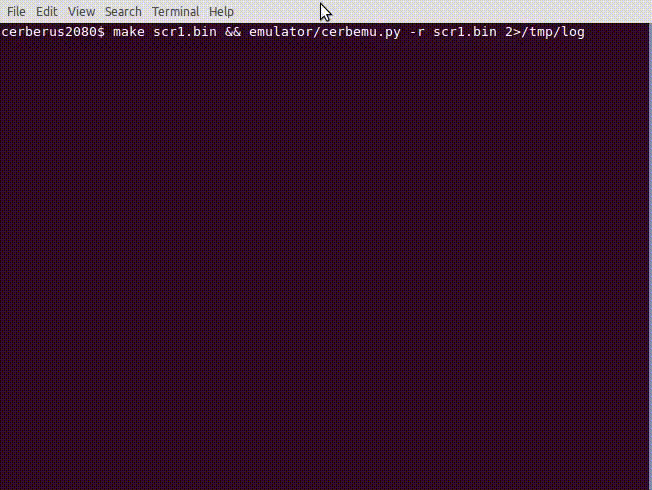

# Cerberus2080

- [Cerberus2080](#cerberus2080)
- [Introduction](#introduction)
- [BIOS](#bios)
  - [Build and flash the BIOS](#build-and-flash-the-bios)
  - [Serial console](#serial-console)
  - [Other available BIOS](#other-available-bios)
- [Emulator](#emulator)
  - [Build the kernel for the emulator](#build-the-kernel-for-the-emulator)
  - [Emulator execution modes](#emulator-execution-modes)
  - [Disassembler](#disassembler)
- [Kernel](#kernel)
  - [Build the kernel for Cerberus](#build-the-kernel-for-cerberus)
  - [Disassemble the kernel binary](#disassemble-the-kernel-binary)
  - [cl65 linker config files](#cl65-linker-config-files)
- [Cerberus2080 Serial Programmer](#cerberus2080-serial-programmer)
  - [Send a file to Cerberus:](#send-a-file-to-cerberus)
- [Credits](#credits)
- [References](#references)

# Introduction

This repo gathers my work on the Cerberus2080.

# BIOS

See files in bios/CERBERUS_2080_BIOS.

For now I've taken Andy Toone's 0xFE BIOS as code base, and I have made some minor changes:
- Reset vector set at `$C000`
- Boots in 6502 fast mode by default
- Write default values to pins *before* setting their mode (we don't want to output unknown/unexpected value in the board)
- Libs are included in the sketch folder, under libraries/
- Enhanced memory dump formatting (all caps, always two digit) with ASCII dump
- After a list command (dump), you can use page-up/down keys to browse the memory.
- Added a couple of build options (see in Makefile):
  - JINGLE_OFF: disable the boot Jingle
  - SOUND_FEEDBACK_OFF: disable the keys feedback sound

I have also added a couple of Makefiles for make the BIOS building from the repo.

You still need to have the Arduino IDE installed, but you won't need to open it.

TODO: detect the Arduino IDE path. For now, you can change the ARDUINO_DIR variable in your Makefile.

## Build and flash the BIOS

By using the Makefile, building and flashing the BIOS is a matter of running a couple of commands:

```
cd bios/CERBERUS_2080_BIOS
make build
make flash
```

Notes:
- Be sure to insert the USB FTDI dongle in the right position
- You need to power the Cerberus board before flashing the BIOS (you can see the USB dongle red led is on)

## Serial console

0xFE BIOS added a serial access to the BIOS. at 9600 8N1. You can use `minicom` to access it:

```
minicom -b 9600
```

## Other available BIOS

- [Andy Toone's 0xFE Bios](https://github.com/atoone/CERBERUS2080/tree/main/CAT)
- [Gordon Henderson's BIOS](https://project-downloads.drogon.net/cerberus2080/)
- [Dean Belfield BreakIntoProgram's BIOS](https://github.com/breakintoprogram/cerberus-bbc-basic/tree/main/cat)
- [The Byte Attic's original BIOS](https://github.com/TheByteAttic/CERBERUS2080/tree/main/CAT)

# Emulator

I've built a somewhat precarious emulator to develop a minimal [Kernel](#kernel). It's based on Py65 for the 6502 emulation, and Curses for the screen rendering.

On one hand, the emulator writes any key pressed to RAM using the MAILBOX/MAILFLAG mechanism.

On the other hand, the emulator intercepts writes to the Display RAM ($F800-$FCAF) and renders the written char on the emulated screen (left pane).

The right pane shows PC, Clock cycles, the 6502 Registers, some variables watches. In step by step mode, the next disassembled instruction will be shown as well.

## Build the kernel for the emulator

In order to build the kernel for the emulator we have to specify `EMULATOR=1`:

```
make clean
EMULATOR=1 make scr1.bin
emulator/cerbemu.py -r scr1.bin
```

At this early stage it looks like this:



## Emulator execution modes

You can alternate between `Continuous` and `Step by step` modes:
- Page Down will enter `Step by step` modes. Press Page Down key to run the next instruction.
- End key will enter `Continuous` modes

## Disassembler

The Emulator will show the next instruction to be run (available in `Step by step` mode only)

# Kernel

At this early stage, I'm working on getting the input of the user (key pressed) rendered on the screen in a terminalish user-friendly way:
- handling line overflows
- scrolling up when reaching last line
- handling backspace and return
- display a cursor (static '_', not flashing at the moment)

That's mainly why I made the [Emulator](#emulator).

## Build the kernel for Cerberus

```
make clean
EMULATOR=1 make scr1.bin
emulator/cerbemu.py -r scr1.bin
```

## Disassemble the kernel binary

Useful to check that everything is where/how it should be:

```
da65 --cpu 65c02 --comments 3 --start-addr $(( 0xC000)) scr1.bin | less
```

## cl65 linker config files

There are two cl65 linker config files (layout of the binary by the lcl65 linker):
- lib/emulator.cfg: for the emulator, which include the whole $C000-$FFFF (so it does includes the interrupt vector table)
- lib/cerberus.cfg: for Cerberus2080, cl65 will not include the interrupt vector table.

# Cerberus2080 Serial Programmer

The `programmer.py` script allows to send commands and load files into Cerberus RAM.

```
$ ./programmer.py -h
usage: programmer.py [-h] [-p PORT] {send,run} ...

Cerberus2080 Serial Programmer

positional arguments:
  {send,run}
    send                Flash a binary file to Cerberus
    run                 Send the run command

optional arguments:
  -h, --help            show this help message and exit
  -p PORT, --port PORT  USB port to use

Written by @adumont
```

## Send a file to Cerberus:

```
usage: programmer.py send [-h] [-a ADDR] file

positional arguments:
  file                  File to send

optional arguments:
  -h, --help            show this help message and exit
  -a ADDR, --addr ADDR  Address (hexadecimal), default: C000
```

Example 1: Load file at 0xC000 (default)

```
$ ./programmer.py send scr1.bin
```

File is sent and loaded into RAM at 0xC000 unless otherwise specified with -a/--addr.

Example 2: Load file at a specific address, for example 0xB000

```
$ ./programmer.py send -a B000 scr1.bin
```
# Credits

- [TheByteAttic/CERBERUS2080: CERBERUS 2080™, the amazing multi-processor 8-bit microcomputer](https://github.com/TheByteAttic/CERBERUS2080)

# References

- [CERBERUS 2080™ | The Byte Attic™](https://www.thebyteattic.com/p/cerberus-2080.html?view=magazine)